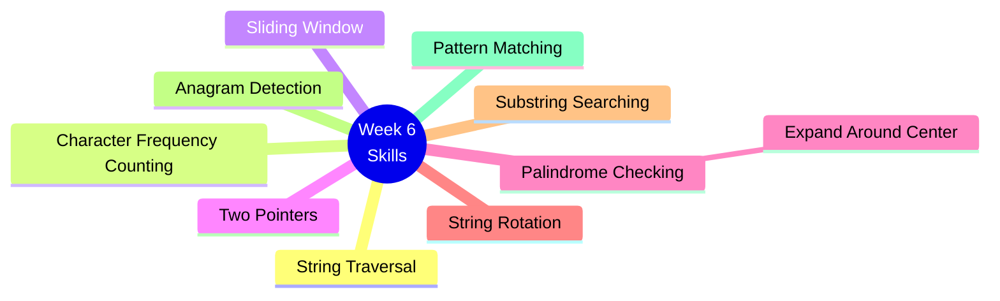
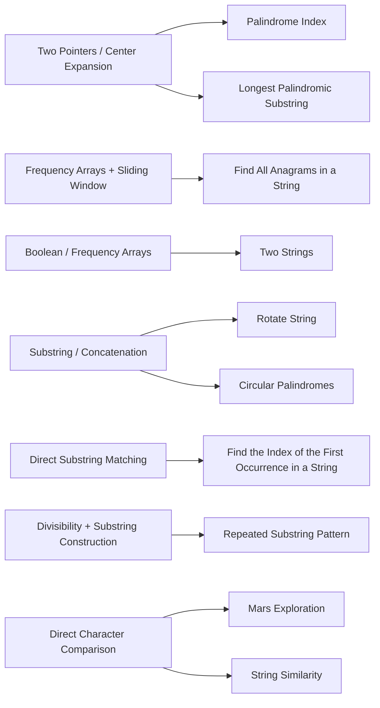
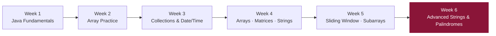

# 📘 Week 6 — Advanced String & Palindrome Problem Solving

> Deep dive into string algorithms: rotations, palindromes, substring matching, and sliding-window techniques.

---

## 🗂️ Problems

| # | Problem | Technique |
|---|---|---|
| 1 | String Similarity | String comparison |
| 2 | Circular Palindromes | Rotation + palindrome (advanced) |
| 3 | Repeated Substring Pattern | Divisibility / substring construction |
| 4 | Two Strings | Common character detection |
| 5 | Rotate String | Substring / concatenation |
| 6 | Mars Exploration | Character comparison |
| 7 | Find All Anagrams in a String | Sliding window + frequency array |
| 8 | Palindrome Index | Two pointers |
| 9 | Find the Index of the First Occurrence in a String | Substring search |
| 10 | Longest Palindromic Substring | Expand around center |

---

## 🧠 Skills Practiced



---

## 🔗 Pattern → Problem Map



---

## 🚀 Advanced Topic: Circular Palindromes

Combines **string rotation** with **palindrome processing** — a significantly harder problem than the rest of the set.

```mermaid
flowchart TD
    S[Input String] --> R[Generate / Consider Rotations]
    R --> P{Is rotation a palindrome?}
    P -->|Naive check per rotation| N[O(n²) — too slow at scale]
    P -->|Optimized| M["Manacher's Algorithm +\nRange-based Processing"]
    M --> O[O(n) / O(n log n) solution]
```

---

## 🎯 Learning Goal

Build strong **string-algorithm fundamentals**, progressing from simple character comparisons to advanced **palindrome and substring techniques**.

---

## 📈 Where This Fits in the Journey

