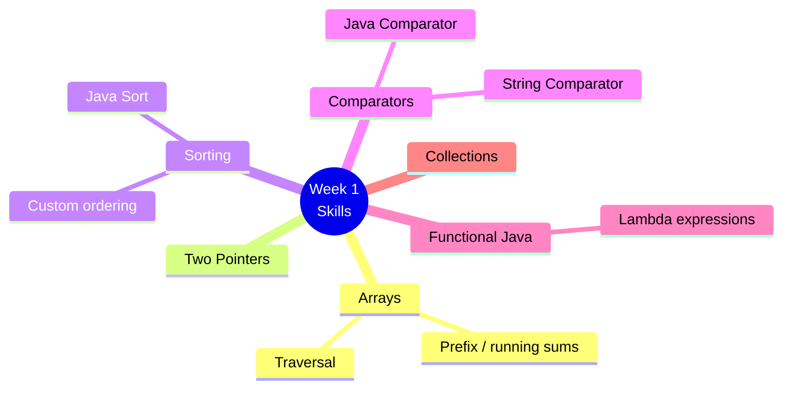
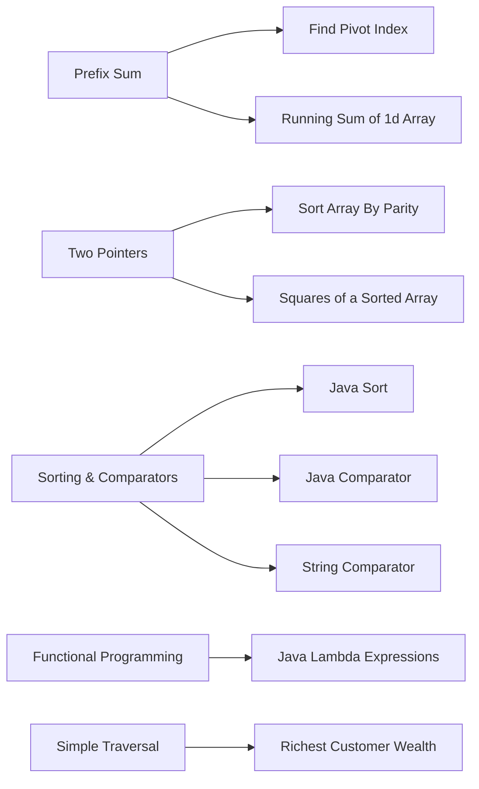
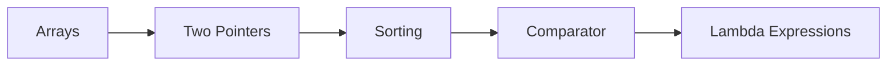
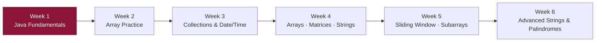

# 📘 Week 1 — Java Problem Solving

`Problem-Sloving-And-Testing-Using-Java`

> Java fundamentals for problem solving: arrays, strings, sorting, comparators, and basic functional programming.

---

## 🗂️ Problems

| # | Problem | Core Idea |
|---|---|---|
| 1 | Find Pivot Index | Prefix sum |
| 2 | Running Sum of 1d Array | Prefix sum |
| 3 | Richest Customer Wealth | Array traversal / max |
| 4 | Sort Array By Parity | Two pointers |
| 5 | Squares of a Sorted Array | Two pointers |
| 6 | Java Comparator | Custom sorting |
| 7 | String Comparator | Custom sorting |
| 8 | Java Sort | Sorting API |
| 9 | Java Lambda Expressions | Functional syntax |

---

## 🧠 Skills Practiced

---

## 🔗 Pattern → Problem Map

---

## 🧭 Suggested Practice Order

---

## 🎯 Learning Goal

Build a strong foundation in **Java syntax** and **basic problem-solving patterns** before moving on to more advanced data structures and algorithms.

---

## 📈 Where This Fits in the Journey

