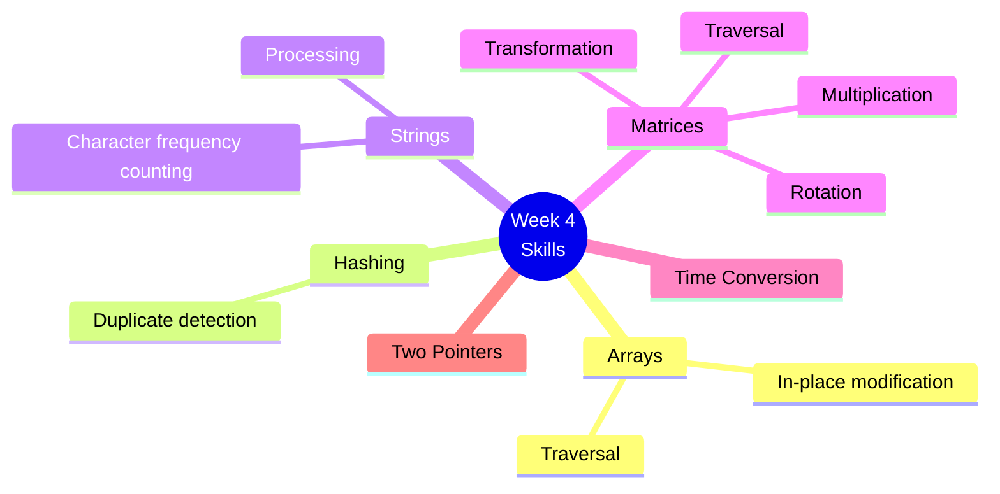
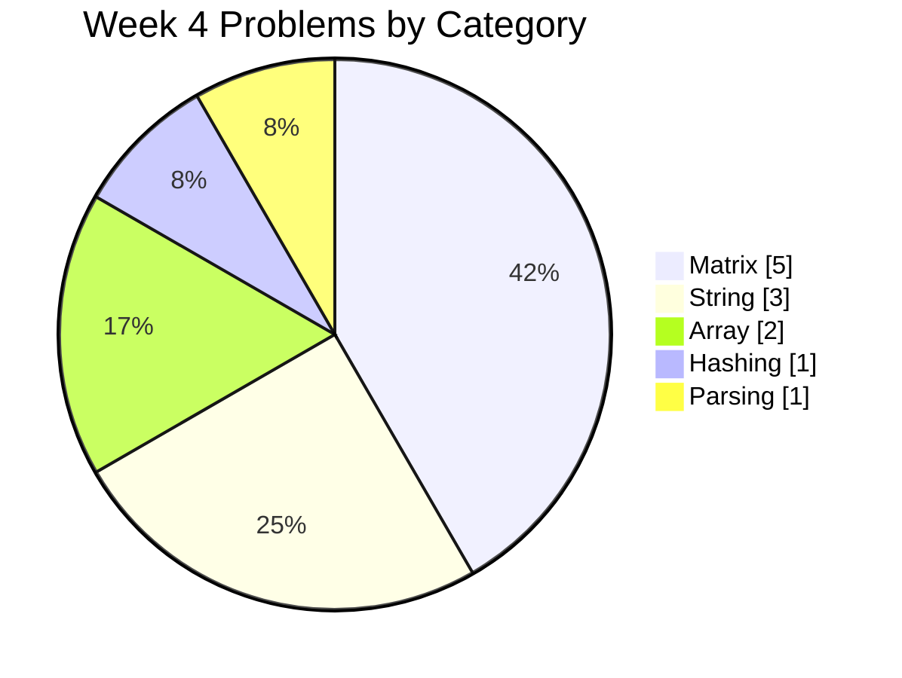
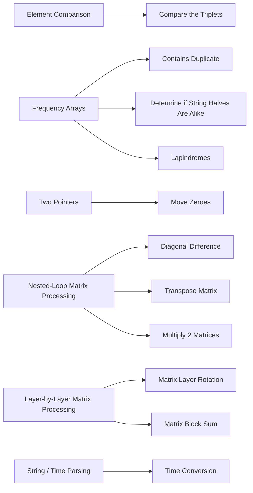
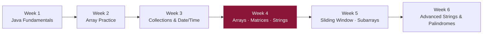

# 📘 Week 4 — Arrays, Matrices, Strings & HackerRank Problems

> A broader set of DSA problems spanning arrays, strings, matrices, sorting, and HackerRank-style challenges.

---

## 🗂️ Problems

| # | Problem | Category |
|---|---|---|
| 1 | Compare the Triplets | Array |
| 2 | Contains Duplicate | Hashing |
| 3 | Determine if String Halves Are Alike | String |
| 4 | Diagonal Difference | Matrix |
| 5 | Lapindromes | String |
| 6 | Matrix Block Sum | Matrix |
| 7 | Matrix Layer Rotation | Matrix |
| 8 | Move Zeroes | Array / Two Pointers |
| 9 | Multiply 2 Matrices | Matrix |
| 10 | Time Conversion | String / Parsing |
| 11 | Transpose Matrix | Matrix |
| 12 | Determine if String Halves Are Alike *(additional practice)* | String |

---

## 🧠 Skills Practiced

---

## 📊 Problems by Category

---

## 🔗 Pattern → Problem Map

---

## 🎯 Learning Goal

Strengthen problem-solving ability across **arrays, strings, and matrices**, and become comfortable pulling problems from both **LeetCode** and **HackerRank**.

---

## 📈 Where This Fits in the Journey

