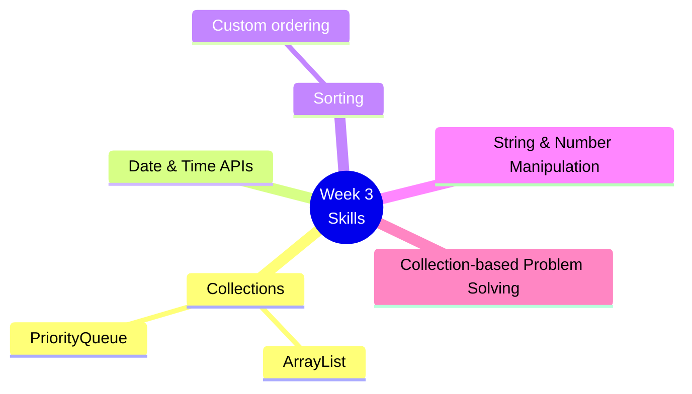
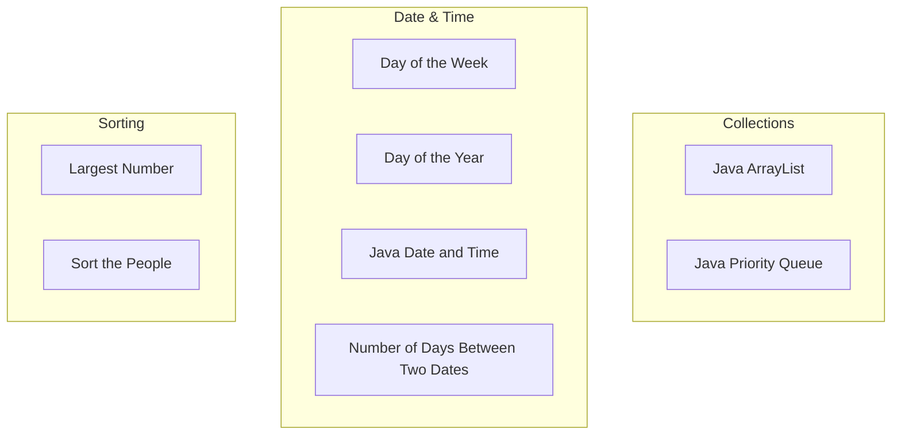
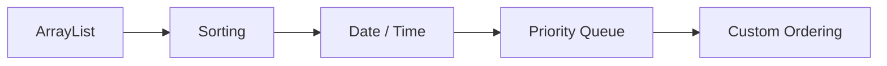
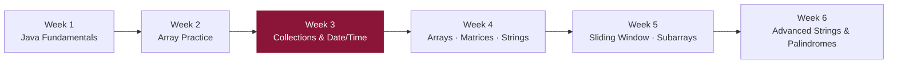

# 📘 Week 3 — Java Collections, Date/Time & Sorting

> Introduces the Java Collections Framework and practical Java APIs, alongside continued algorithmic practice.

---

## 🗂️ Problems / Topics

| # | Problem / Topic | Java API Focus |
|---|---|---|
| 1 | Day of the Week | Date/Time API |
| 2 | Day of the Year | Date/Time API |
| 3 | Java ArrayList | Collections |
| 4 | Java Date and Time | Date/Time API |
| 5 | Java Priority Queue | Collections |
| 6 | Largest Number | Custom sorting |
| 7 | Number of Days Between Two Dates | Date/Time API |
| 8 | Sort the People | Custom sorting |

---

## 🧠 Skills Practiced

---

## 🔗 Topic Grouping

---

## 🧭 Suggested Practice Order

---

## 🎯 Learning Goal

Get comfortable with **Java's collection framework** and commonly used library classes, while continuing to sharpen algorithmic thinking.

---

## 📈 Where This Fits in the Journey

