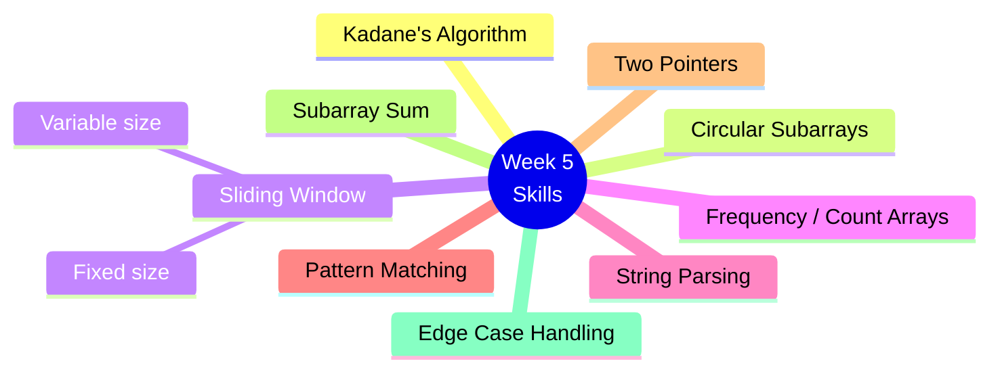
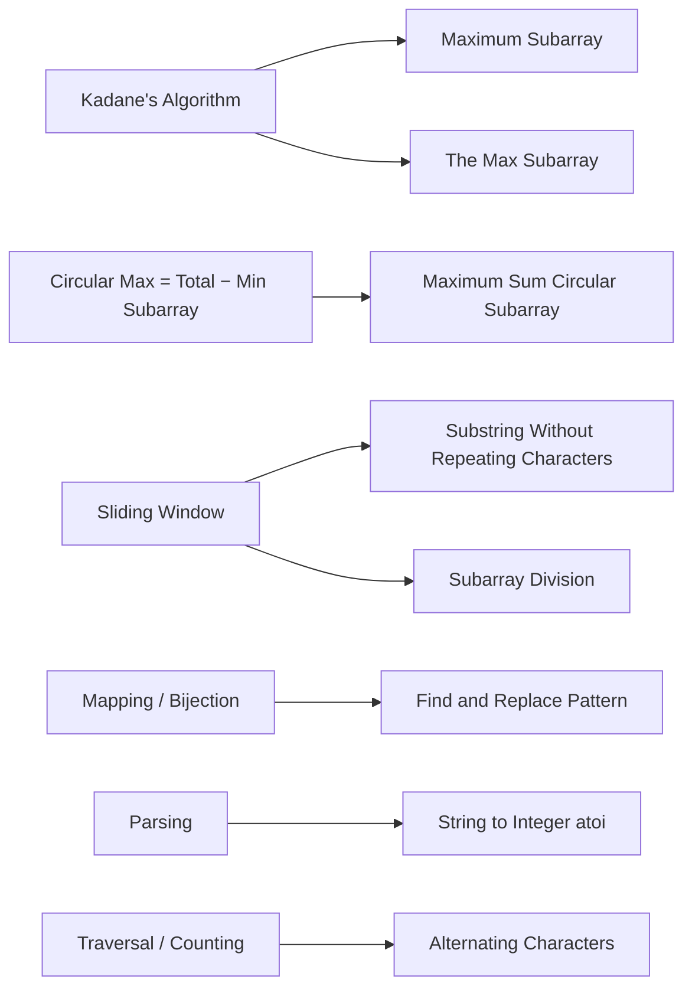
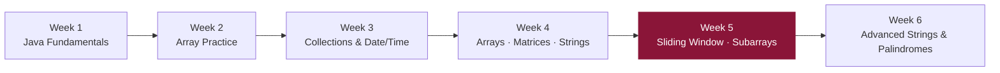

# 📘 Week 5 — Strings, Subarrays & Sliding Window

> Important string and subarray patterns: Kadane's algorithm, sliding windows, pattern matching, parsing, and circular-array techniques.

---

## 🗂️ Problems

| # | Problem | Technique |
|---|---|---|
| 1 | Maximum Sum Circular Subarray | Kadane's algorithm (circular) |
| 2 | Alternating Characters | Traversal / counting |
| 3 | Find and Replace Pattern | Mapping / bijection |
| 4 | Maximum Subarray | Kadane's algorithm |
| 5 | String to Integer (atoi) | Parsing |
| 6 | Subarray Division | Fixed-size sliding window |
| 7 | Substring Without Repeating Characters | Sliding window |
| 8 | The Max Subarray | Kadane's algorithm |

---

## 🧠 Skills Practiced



---

## 🔗 Pattern → Problem Map



---

## 🪜 From Brute Force to Optimal

```mermaid
flowchart LR
    BF[Brute Force\nO(n²) or O(n³)] -->|recognize pattern| OPT[Optimized\nO(n) via Kadane / Sliding Window]
```

---

## 🎯 Learning Goal

Recognize common **interview patterns** and improve the ability to optimize brute-force solutions into **linear or near-linear algorithms**.

---

## 📈 Where This Fits in the Journey

